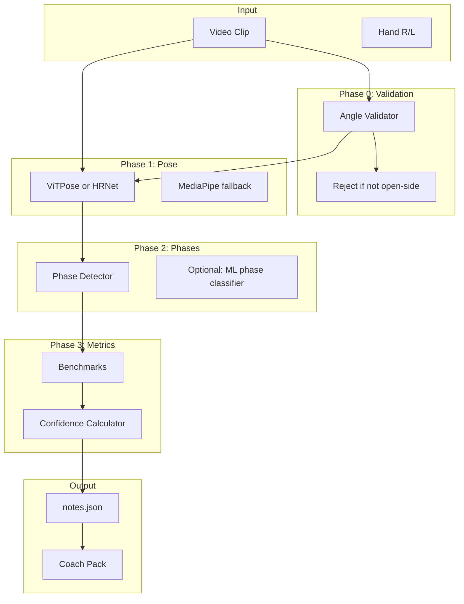

# Mechanics Evaluation Engine Overhaul

## Current State

The pipeline uses a center-field camera for command, but mechanics uses an **open-side camera** (3B for RHP, 1B for LHP). The engine:

- **Pose**: MediaPipe Pose (33 landmarks, CPU, degrades with occlusion)
- **Phases**: Heuristic rules (motion energy, knee Y-min, ankle velocity drop, wrist velocity peak)
- **Confidence**: `CONF_BLIND=0.15`, `CONF_FULL=0.60`; visibility, jitter, window size
- **Metrics**: Open-side v3 set (lead_leg_block_v3, hip_shoulder_sep_v3, etc.); front-only metrics excluded
- **Angle classifier**: Heuristic (HSV, optical flow, symmetry) — `open_side_RHP`, `open_side_LHP`, etc.

Key docs: [docs/runbooks/mechanics_cv.md](docs/runbooks/mechanics_cv.md), [src/mechanics/](src/mechanics/)

---

## Architecture

---

## Phase 0: Camera Angle Validation

**Goal**: Reject or clearly flag clips that are not open-side.

**Files**: `src/ingest/angle_classify.py`, new `src/mechanics/angle_validator.py`

- Add `validate_open_side(video_path, hand) -> (valid: bool, confidence: float, reject_reason?: string)`
- Use existing angle classifier; if confidence < 0.7 for `open_side_RHP`/`open_side_LHP`, return `valid=False` with reason
- In `run_mechanics_session.py` and `mechanics_coach_pack.py`: if validation fails, skip clip or write `notes.json` with `camera_view_unknown` and `status="rejected"` so user knows to re-film
- Optional: add `--strict-angle` flag to auto-reject non-open-side clips

---

## Phase 1: Pose Estimation Upgrade

**Goal**: Replace or augment MediaPipe with a higher-accuracy model for occlusion.

**Files**: `src/mechanics/pose.py`, new `src/mechanics/pose_vitpose.py` (or `pose_hrnet.py`)

**Option A — ViTPose (recommended)**:

- ViTPose: top-down pose estimation, strong on occlusion
- Use `mmpose` or `onnxruntime`; model ~200MB
- Map ViTPose output to MediaPipe-like 33-landmark format (or a subset) for downstream compatibility
- Fallback: if ViTPose fails or GPU unavailable, use MediaPipe

**Option B — HRNet**:

- HRNet-W32: high accuracy, heavier
- Similar integration via mmpose or ONNX

**Implementation**:

- Add `extract_poses_vitpose(video_path, ...) -> List[PoseResult]` returning same `PoseResult` schema
- `pose.py`: add `POSE_BACKEND` env or config: `mediapipe` | `vitpose`
- Scripts: `--pose-backend vitpose` when available
- Per-landmark visibility confidence from ViTPose (or use MediaPipe visibility if ViTPose doesn’t provide it)

**Dependencies**: `mmpose` or `onnxruntime`; optional GPU; model download in `scripts/download_pose_models.py`

---

## Phase 2: Phase Detection Improvements

**Goal**: More reliable SET, FOOT_STRIKE, BALL_RELEASE.

**Files**: [src/mechanics/phases.py](src/mechanics/phases.py), new `src/mechanics/phases_ml.py` (optional)

**2a. Heuristic refinements**:

- Add `phase_confidence` per phase (already partially present; expand)
- Ball release: use ball detection (YOLO) if available; otherwise keep wrist velocity with explicit low-confidence flag
- Foot strike: use lead ankle + lead knee for robustness when one is occluded
- SET: improve motion-energy baseline; add idle-prefix detection

**2b. ML phase classifier (optional)**:

- Train on 20+ labeled clips: input = keypoint time series, output = phase frame indices
- Small 1D-CNN or Transformer; ~5k params
- Use as primary when `--phase-model` is set; fallback to heuristics

**2c. Phase confidence propagation**:

- Each phase exposes `confidence` and `reason` (e.g. `occluded`, `low_motion`)
- Metrics that depend on phases use those confidences in their own confidence

---

## Phase 3: Confidence Architecture

**Goal**: Higher confidence for open-side when data is good; clearer degradation when not.

**Files**: [src/mechanics/confidence.py](src/mechanics/confidence.py), [src/mechanics/benchmarks.py](src/mechanics/benchmarks.py)

**3a. Angle-aware confidence**:

- If `view_mode == open_side` and angle validation passed: boost confidence floor for open-side metrics
- If angle validation failed: cap confidence at 0.3 for all metrics

**3b. Confidence sources**:

- `conf_from_landmark_quality`: per-window landmark visibility and stability
- `conf_from_phase_quality`: phase detector confidence
- `conf_from_pose_backend`: ViTPose vs MediaPipe (ViTPose = higher base)
- `conf_from_occlusion`: detect occlusion (e.g. lead leg behind drive leg) and reduce confidence

**3c. Metric-specific confidence**:

- `lead_leg_block_v3`: requires knee, ankle, hip visibility at FS and REL
- `hip_shoulder_sep_v3`: requires shoulder, hip visibility
- `release_extension_v2`: requires wrist visibility at release (most sensitive to motion blur)

**3d. Tuning**:

- `CONF_FULL` could be increased to 0.70 for open-side when pose backend is ViTPose
- Add `confidence_breakdown` in `notes.json` per metric (visibility, phase, occlusion)

---

## Phase 4: Metric Refinements for Open-Side

**Goal**: Metrics that are more robust and interpretable for open-side only.

**Files**: [src/mechanics/benchmarks.py](src/mechanics/benchmarks.py), [src/mechanics/coach_pack.py](src/mechanics/coach_pack.py)

- Add `open_side_only` flag to each metric; enforce in pipeline
- Refine thresholds using real data (e.g. lead_leg_block_v3 scoring bands)
- Add `metric_reliability` to notes: `high` | `medium` | `low` per metric based on confidence + landmark quality
- Coach pack: prioritize high-reliability metrics in callouts; de-emphasize low-reliability

---

## Phase 5: Validation and Ground Truth

**Goal**: Measure improvements and iterate.

**Files**: `tests/mechanics/`, new `scripts/mechanics_validate.py`

- Create `manual_phases.json` template: manual frame indices for SET, PLL, FS, REL
- Add 5–10 labeled clips with ground-truth phases
- `mechanics_validate.py`: compare detected vs manual phases; report MAE
- Add `scripts/mechanics_validate_pose.py`: compare pose overlay to manual joint clicks (optional)
- CI: run validation on labeled set; fail if metrics regress

---

## Phase 6: Web UI and Notes

**Goal**: Surface confidence and limitations clearly.

**Files**: [web/app/components/mechanics/MechanicsConfidencePanel.tsx](web/app/components/mechanics/MechanicsConfidencePanel.tsx), [web/lib/mechanics/types.ts](web/lib/mechanics/types.ts)

- Extend `NotesJson`: `pose_backend`, `angle_validated`, `confidence_breakdown`
- MechanicsConfidencePanel: show "Open-side validated" badge when angle passed
- Show "Pose: ViTPose" vs "Pose: MediaPipe" when available
- Low-confidence metrics: show reason (occlusion, phase uncertain, etc.)

---

## Implementation Order

| Phase                        | Priority | Effort | Dependencies                 |
| ---------------------------- | -------- | ------ | ---------------------------- |
| 0. Angle validation          | High     | Low    | None                         |
| 1. Pose estimation (ViTPose) | High     | High   | GPU optional, model download |
| 2. Phase detection           | Medium   | Medium | Phase 1                      |
| 3. Confidence architecture   | High     | Medium | Phase 0, 1                   |
| 4. Metric refinements        | Medium   | Low    | Phase 3                      |
| 5. Validation pipeline       | Medium   | Medium | Labeled clips                |
| 6. Web UI                    | Low      | Low    | Phase 3                      |

---

## Key Files to Modify

| File                                                        | Changes                                      |
| ----------------------------------------------------------- | -------------------------------------------- |
| `src/mechanics/pose.py`                                     | Add backend switch, ViTPose integration      |
| `src/mechanics/confidence.py`                               | Angle-aware, pose-backend, occlusion factors |
| `src/mechanics/phases.py`                                   | Phase confidence, refinement heuristics      |
| `src/mechanics/benchmarks.py`                               | Metric-specific confidence, reliability      |
| `src/mechanics/coach_pack.py`                               | Use new confidence, angle validation         |
| `scripts/run_mechanics_session.py`                          | Angle validation, pose backend flag          |
| `scripts/mechanics_coach_pack.py`                           | Same                                         |
| `web/lib/mechanics/types.ts`                                | Extended NotesJson                           |
| `web/app/components/mechanics/MechanicsConfidencePanel.tsx` | New fields                                   |

---

## New Files to Create

- `src/mechanics/angle_validator.py` — open-side validation
- `src/mechanics/pose_vitpose.py` — ViTPose wrapper
- `scripts/download_pose_models.py` — model download
- `scripts/mechanics_validate.py` — phase validation
- `tests/mechanics/test_angle_validator.py`
- `tests/mechanics/test_pose_vitpose.py`

---

## Risks and Mitigations

- **ViTPose GPU**: Offer optional CPU mode (slower); document GPU requirement
- **Model size**: ~~200MB; cache in `~~/.cache/pitch-tracker/`or`output/mechanics_models/`
- **Breaking changes**: Keep MediaPipe as default; ViTPose opt-in via `--pose-backend vitpose` or env

