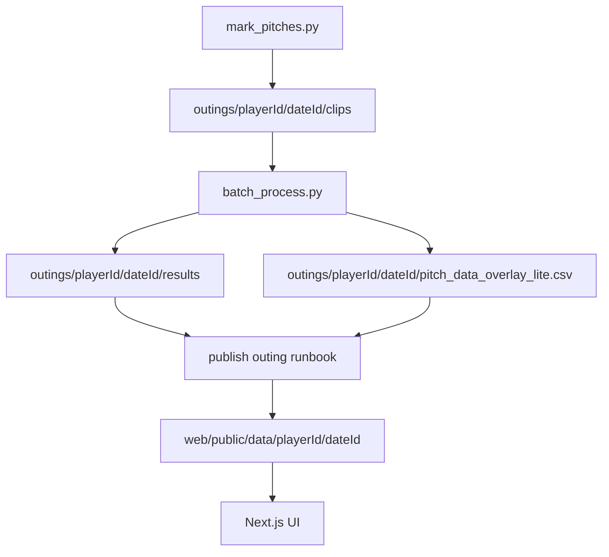

## System Overview

Pitch Tracker measures pitch command by tracking the catcher's glove target and ball arrival using SAM 2 (Segment Anything Model 2), computing miss distance from a center-field camera perspective. It produces per-pitch metrics and publishes review assets to a Next.js web app.

### Data Flow

1. **Mark pitches** (`mark_pitches.py`): User scrubs through full inning video, marks target frame (glove set) and arrival frame (ball reaches catcher) for each pitch. Outputs clips and `pitch_log.json`.
2. **Process pitches** (`batch_process.py`): For each clip, runs SAM 2 segmentation on glove (target frame) and ball (arrival frame), computes miss distance, writes CSV row and overlay video.
3. **Publish**: Copy clips, overlays, and CSV into `web/public/data/<playerId>/<dateId>/`. Update `web/lib/dataIndex.ts`.
4. **Display** (Next.js UI): Player dashboards, scouting reports, scatter plots, heatmaps, and video playback.

### Key Components

- **SAM 2**: Core segmentation. Image predictor (fast/overlay-lite) for single-frame; video predictor (debug) for multi-frame propagation.
- **Calibration** (`calibrate.py`): Establishes `pixels_per_inch` via home plate width (17 inches). All inch measurements depend on this.
- **Detection ROI**: Crop region in `config.yaml` bounding the catcher area. All SAM 2 processing uses ROI-cropped frames.

### Design Assumptions

- Static center-field camera. No panning or zoom.
- One pitch per clip.
- Manual T/A frame marking. At 30fps, a 90mph fastball moves ~17 inches per frame.
- Manual ball click. No automatic ball detection.
- Catcher's glove visible at target frame. Ball visible at arrival frame.
- Calibration accuracy determines inch measurement accuracy. Pixel values are always correct.
