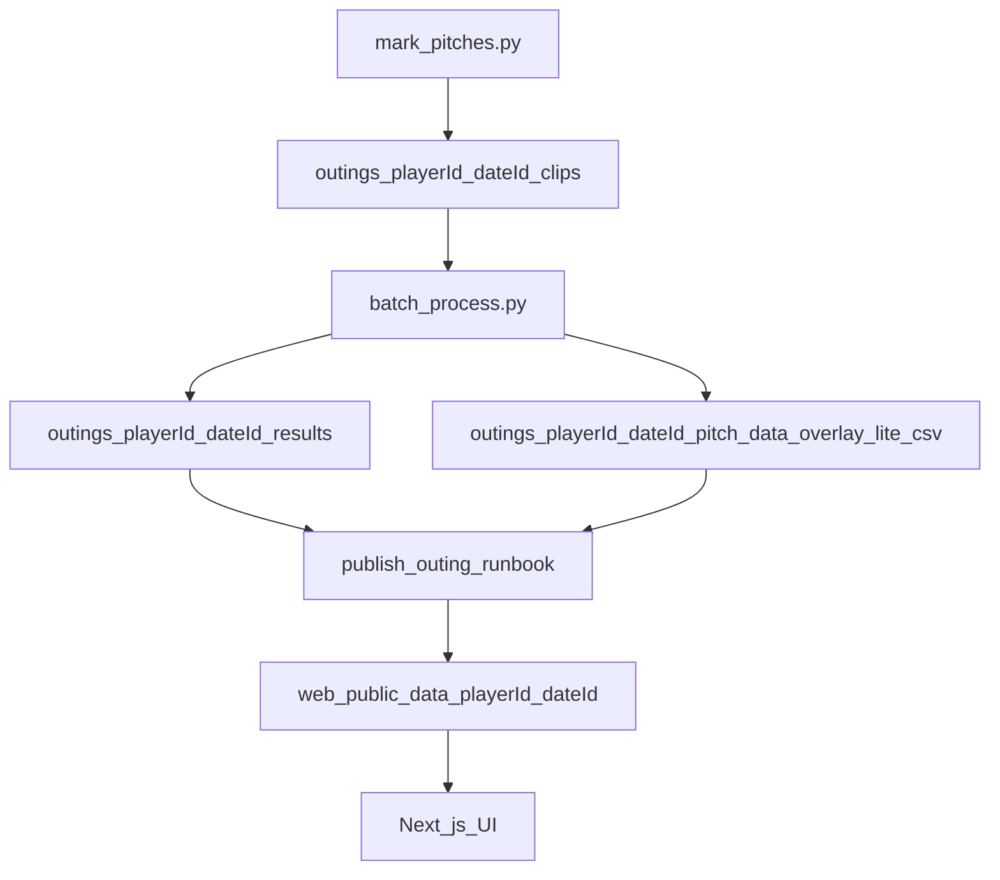

## Critical Edge Cases and Constraints (Must Not Miss)

Before executing this plan, Cursor must incorporate these 6 constraints. Do not "fix" things inconsistently.

### 1. Canonical dateId reality

The repo currently has dateIds like `03_26_25` in some places (e.g. `web/lib/dataIndex.ts` for DJames1, CBurrows1). **This refactor MUST normalize all dateIds to `yyyy_mm_dd` (option B).**

- **Canonical dateId**: `yyyy_mm_dd` (zero padded), optionally `yyyy_mm_dd_01` for same-day suffix.
- **Legacy dateId example**: `03_26_25` (mm_dd_yy) MUST be treated as legacy and normalized.
- **Normalization rule**: `mm_dd_yy` → `20yy_mm_dd` (e.g. `03_26_25` → `2025_03_26`). If a future dataset includes 19xx, the script must support an override flag, but default is 20xx.

Required deliverables in this refactor:

- Create a migration runbook: `docs/runbooks/normalize_dateIds.md`
- Create a migration script: `scripts/normalize_dateIds.py`
  - Must update both:
    - filesystem paths (`outings/<playerId>/<dateId>` and `web/public/data/<playerId>/<dateId>`) when legacy folders exist
    - `web/lib/dataIndex.ts` outing IDs and `buildDataPaths()` calls
  - Must be safe-by-default (dry run unless `--execute`)
  - Must emit a before/after report and validate that published assets still align with CSV pitch counts.

### 2. Explicit mapping: what is generated vs never touched

`**scripts/update_docs.py` MUST generate only these files** (exact filenames):

- `docs/generated/web_app_data_contract.md`
- `docs/generated/publishing_workflow.md`
- `docs/generated/outing_selection_logic.md`
- `docs/generated/perspective_and_lanes.md`
- `docs/generated/thresholds_on_target_outliers.md`
- `docs/generated/cli_args.md`

**The script MUST NEVER touch:**

- `CLAUDE.md` (constitution)
- `docs/runbooks/*`
- `docs/architecture/*`
- `docs/pipeline/*`
- `docs/web/*` (hand-written)
- `docs/ROUTING.md`, `docs/INDEX.md`, `docs/STYLE_GUIDE.md`, `docs/GOVERNANCE.md`

### 3. Stub policy

Pointer stubs at old locations MUST be **tiny and consistent**:

- **Length**: 3–6 lines only.
- **Required lines**:
  - `Moved →`  + path to new location (e.g. `docs/legacy/Usage_Guides/PitchTracker_UserGuide.md`)
  - `Canonical doc →`  + path to the authoritative doc for that topic (e.g. `docs/runbooks/publish_outing.md`)
- No long explanations. No copy-paste of old content.

Example stub:

```markdown
Moved → docs/legacy/Usage_Guides/PitchTracker_UserGuide.md
Canonical doc → docs/runbooks/publish_outing.md
```

### 4. Commit strategy

Use **2–3 commits max**. Keeps history clean and reversible.

- **Commit 1**: Structure + moves (create `docs/`, `memory/`, archive `claude.md` → `docs/legacy/claude_YYYY-MM-DD.md`, relocate legacy docs, add pointer stubs, write new CLAUDE.md constitution).
- **Commit 2**: Generator + checks (refactor `scripts/update_docs.py` to write `docs/generated/*`, add `scripts/check_docs.py`, update `.githooks/pre-commit`).
- **Commit 3 (optional)**: Hooks + skills (publish_outing.sh, trackerpublish skill, any final wiring).

### 5. Safety: archive old CLAUDE.md with timestamp

**Before replacing** `claude.md` with the new constitution:

1. Copy the **full current content** of `claude.md` to `docs/legacy/claude_YYYY-MM-DD.md` (use today's date, e.g. `claude_2026-02-11.md`).
2. Verify the archive file exists and is complete.
3. Only then rename `claude.md` → `CLAUDE.md` and write the new constitution.

Otherwise someone might overwrite it and lose provenance.

### 6. Acceptance tests (required in plan)

The plan MUST require these exact checks before considering the refactor complete:

```bash
npm --prefix web run build
python3 -m compileall src
```

```bash
python3 scripts/update_docs.py --propose
# Verify: produces only docs/generated/* (no edits to CLAUDE.md)
```

```bash
python3 scripts/check_docs.py
# Must pass
```

```bash
test $(wc -c < CLAUDE.md) -lt 40000
# CLAUDE.md < 40k chars
```

If any check fails, the refactor is incomplete.

---

## Recommended New Structure

```text
docs/
  INDEX.md
  ROUTING.md
  STYLE_GUIDE.md
  GOVERNANCE.md
  architecture/
    overview.md
    coordinates_and_handedness.md
    folder_contract.md
  pipeline/
    batch_process.md
    mark_pitches.md
    segment_pitches.md
    calibration_and_roi.md
    outputs_and_csv_schema.md
  runbooks/
    publish_outing.md
    migrate_outings.md
    normalize_dateIds.md
    update_arsenals_csv.md
    doc_maintenance.md
  web/
    data_indexing.md
    video_player.md
    reports_kpis_outliers.md
  troubleshooting/
    common_failures.md
  generated/
    web_app_data_contract.md
    publishing_workflow.md
    outing_selection_logic.md
    perspective_and_lanes.md
    thresholds_on_target_outliers.md
    cli_args.md
  legacy/
    Usage_Guides/
      PitchTracker_UserGuide.md
      User_Commands_Template.md
    web/
      README.md
    plans/
      outing-comparison-mvp.md
      full_migration_to_new_folder_format_f1f15501.plan.md
      approval_gate_corrected_plan.md
memory/
  MEMORY.md

.claude/
  skills/
    trackerpublish/
      SKILL.md

scripts/
  update_docs.py
  check_docs.py
  normalize_dateIds.py

.githooks/
  pre-commit

publish_outing.sh
CLAUDE.md
README.md
```

### File purposes (short, non-overlapping)

- `**CLAUDE.md**`: Constitution only—hard invariants, mental model, and pointers. No runbooks.
- `**docs/ROUTING.md**`: Single routing index (task → canonical doc).
- `**docs/INDEX.md**`: Human-friendly “docs home” with the same canonical pointers (not a second routing source—just a curated entrypoint).
- `**docs/generated/***`: Auto-generated reference docs from code. Treated as derived artifacts; edited only by generator.
- `**docs/runbooks/***`: Step-by-step operational workflows (publish, migrate, update arsenals, doc maintenance). Human-readable, used by agents too.
- `**docs/architecture/***`: Invariants and definitions that multiple subsystems depend on (coordinates, handedness, folder contract). These are “conceptual source of truth”.
- `**docs/pipeline/***`: Python processing workflows and CLI usage beyond auto-generated arg lists.
- `**docs/web/***`: Next.js + reporting conventions.
- `**docs/legacy/***`: Immutable archive of relocated older docs/plans to guarantee no knowledge loss.
- `**memory/MEMORY.md**`: Living operational memory: recent migrations, current known gaps, next cleanup items; short and time-scoped.
- `**scripts/check_docs.py**`: Lightweight drift/size checks.

---

## CLAUDE.md New Draft (Constitution)

(Full proposed file text; target <25k chars.)

```markdown
## Pitch Tracker — Constitution (Read First)

Pitch Tracker measures command by comparing a catcher target (glove) to ball arrival in **image space** using a **center-field camera**. It produces per-pitch metrics and publishes review assets to a Next.js web app.

This file is the **constitution**: hard invariants + the minimal mental model. Detailed workflows live in `docs/`.

### Canonical perspective (non-negotiable)

- **Camera**: center-field, behind pitcher, looking toward home plate.
- **Image axes**: origin top-left; +X right (toward 1B), +Y down (toward ground).

### Miss vector definition (non-negotiable)

- **Definition**: `dx = ball_x - target_x`, `dy = ball_y - target_y`.
- **Meaning**:
  - `dx > 0`: ball is right of target in the image (toward 1B)
  - `dy > 0`: ball is below target in the image (low)

Do not redefine these. Any “direction” labeling derives from these values.

### Arm-side / glove-side labeling (non-negotiable)

Horizontal direction is labeled relative to pitcher handedness:

```python
arm_sign = 1 if pitcher_hand == "R" else -1
h_direction = "arm-side" if dx * arm_sign > 0 else "glove-side"
```

This repo’s single source of truth for web-side handedness normalization is `web/lib/handedness.ts`.

### Canonical folder backbone (non-negotiable)

These two directory contracts are the backbone of the system:

- **Processing outputs (local)**: `outings/<playerId>/<dateId>/`
- **Published web assets**: `web/public/data/<playerId>/<dateId>/`

`playerId` format: e.g. `DJames1`, `CBurrows1`

`dateId` format: `yyyy_mm_dd` (zero padded), optionally `yyyy_mm_dd_01` for same-day suffix.

### Golden paths (high level)

- **Primary pipeline**: `src/mark_pitches.py` → `src/batch_process.py` → publish to web app.
- **Legacy/Debug**: standalone scripts exist for debugging only.

### Where to look (routing)

- Task routing index (agents and humans): `docs/ROUTING.md`
- Architecture invariants: `docs/architecture/*`
- Runbooks (publish/migrate/etc.): `docs/runbooks/*`
- Auto-generated reference (CLI args, web contract): `docs/generated/*`

### Editing rules (doc governance)

- Treat `docs/generated/*` as derived artifacts—do not hand-edit.
- When code behavior changes, update the **canonical** doc for that topic (see `docs/ROUTING.md`).
- Keep this constitution slim. If a section needs step-by-step instructions, it belongs in `docs/runbooks/` or `docs/pipeline/`.

### Known drift to resolve

If you find a mismatch between code, data folders, and docs, record it in `memory/MEMORY.md` and fix at the canonical source.

```

---

## Docs to Create/Move (exact file list + scope boundaries)

### 1) Create new docs (hand-written)

- [docs/ROUTING.md](docs/ROUTING.md)
  - **Scope**: single routing index. One row per task. Links only to canonical docs.
  - **Must not**: contain full runbooks.

- [docs/INDEX.md](docs/INDEX.md)
  - **Scope**: docs landing page.
  - **Must not**: become a second routing table (link to `docs/ROUTING.md`).

- [docs/STYLE_GUIDE.md](docs/STYLE_GUIDE.md)
  - **Scope**: doc writing conventions, headings, examples, naming.

- [docs/GOVERNANCE.md](docs/GOVERNANCE.md)
  - **Scope**: ownership, generated vs hand-written boundaries, how updates happen.

- [docs/architecture/overview.md](docs/architecture/overview.md)
  - **Scope**: system mental model & data flow.

- [docs/architecture/coordinates_and_handedness.md](docs/architecture/coordinates_and_handedness.md)
  - **Scope**: perspective, dx/dy, truth table, CSV sign convention, web conversion via `web/lib/handedness.ts`.
  - **Canonical**: this doc owns these definitions (constitution links here).

- [docs/architecture/folder_contract.md](docs/architecture/folder_contract.md)
  - **Scope**: required per-outing directory shapes (local + web), naming conventions, pitch_number ↔ filenames.
  - **Canonical**: this doc owns “folder contract”.

- [docs/runbooks/publish_outing.md](docs/runbooks/publish_outing.md)
  - **Scope**: end-to-end publish workflow. Includes validations and how to update `web/lib/dataIndex.ts`.
  - **Canonical**: this doc owns publishing.

- [docs/runbooks/migrate_outings.md](docs/runbooks/migrate_outings.md)
  - **Scope**: migrations (legacy → new structure), validation checklist, rollback.

- [docs/runbooks/normalize_dateIds.md](docs/runbooks/normalize_dateIds.md)
  - **Scope**: dateId normalization to `yyyy_mm_dd` (and optional `_01` suffix), including a script-driven migration for any legacy `mm_dd_yy` ids.
  - **Canonical**: this doc owns dateId normalization rules and the migration procedure.

- [docs/runbooks/update_arsenals_csv.md](docs/runbooks/update_arsenals_csv.md)
  - **Scope**: keeping `data/Arsenals.csv` and `web/public/data/Arsenals.csv` in sync.

- [docs/runbooks/doc_maintenance.md](docs/runbooks/doc_maintenance.md)
  - **Scope**: how to run generation + checks; what’s generated; how pre-commit behaves.

- [docs/pipeline/*](docs/pipeline/)
  - **Scope**: pipeline-specific operational docs beyond arg lists:
    - what inputs/outputs are expected
    - what files are authoritative (`clips/pitch_log.json` expectations)
    - speed modes mental model (fast vs overlay-lite vs debug)

- [docs/web/*](docs/web/)
  - **Scope**: dataIndex conventions, video player shortcuts, report thresholds.

- [docs/troubleshooting/common_failures.md](docs/troubleshooting/common_failures.md)

- [memory/MEMORY.md](memory/MEMORY.md)
  - **Scope**: dated bullets for drift and TODOs.

### 2) Create generated docs (written by script)

Under [docs/generated/](docs/generated/): each is generated by `scripts/update_docs.py`.

- `web_app_data_contract.md`
- `publishing_workflow.md`
- `outing_selection_logic.md`
- `perspective_and_lanes.md`
- `thresholds_on_target_outliers.md`
- `cli_args.md`

### 3) Relocate (preserve content, avoid duplication)

Move existing files into `docs/legacy/` and replace originals with short pointers.

- Move:
  - [Usage Guides/PitchTracker_UserGuide.md](Usage%20Guides/PitchTracker_UserGuide.md) → `docs/legacy/Usage_Guides/PitchTracker_UserGuide.md`
  - [Usage Guides/User Commands Template.md](Usage%20Guides/User%20Commands%20Template.md) → `docs/legacy/Usage_Guides/User_Commands_Template.md`
  - [web/README.md](web/README.md) → `docs/legacy/web/README.md`
  - [tasks/outing-comparison-mvp.md](tasks/outing-comparison-mvp.md) → `docs/legacy/plans/outing-comparison-mvp.md`
  - [scripts/full_migration_to_new_folder_format_f1f15501.plan.md](scripts/full_migration_to_new_folder_format_f1f15501.plan.md) → `docs/legacy/plans/full_migration_to_new_folder_format.plan.md`
  - [.cursor/plans/approval_gate_corrected_plan.md](.cursor/plans/approval_gate_corrected_plan.md) → `docs/legacy/plans/approval_gate_corrected_plan.md`

- Replace originals with **pointer stubs** (see Stub policy above): 3–6 lines, exactly:
  - `Moved → ` + path
  - `Canonical doc → ` + path

### 4) Consolidate skills

- Keep `.claude/skills/trackerpublish/SKILL.md` as the invocation entry.
- Update it so the **canonical workflow** is `docs/runbooks/publish_outing.md`.
- Deprecate `.claude/skills/publish-outing.md` by replacing content with a pointer to `docs/runbooks/publish_outing.md` (but keep the original full text archived under `docs/legacy/` first).

---

## Routing Index (task → canonical doc)

This becomes [docs/ROUTING.md](docs/ROUTING.md). Example content:

- **Publish a completed outing** → `docs/runbooks/publish_outing.md`
- **Outing folder structure / naming** → `docs/architecture/folder_contract.md`
- **Arm-side / glove-side definitions** → `docs/architecture/coordinates_and_handedness.md` + `web/lib/handedness.ts`
- **Update thresholds (on-target/outliers)** → `web/lib/reportModel.ts` + `docs/web/reports_kpis_outliers.md` (generated summary in `docs/generated/thresholds_on_target_outliers.md`)
- **Update CLI args docs** → `docs/generated/cli_args.md` (generated from `src/*.py`)
- **Fix video player shortcuts** → `web/app/components/VideoPlayer.tsx` + `docs/web/video_player.md`
- **Segment pitches (manual/auto)** → `docs/pipeline/segment_pitches.md` + `docs/generated/cli_args.md`
- **Doc automation** → `docs/runbooks/doc_maintenance.md` + `scripts/update_docs.py`

---

## Style Guide (recommended)

Add to [docs/STYLE_GUIDE.md](docs/STYLE_GUIDE.md).

- **Headings**: Use `##` for doc title, `###` for major sections, `####` for subsections.
- **Tone**: directive, operational, unambiguous. Prefer “Do X” over “You might”.
- **Bullets**: start with a bold label when listing mixed items.
- **Naming**:
  - `playerId`: `InitialLastNameN` (e.g. `DJames1`)
  - `dateId`: `yyyy_mm_dd` or `yyyy_mm_dd_01`
  - `outingId`: `<playerId>/<dateId>`
- **Examples**: include at least one realistic example per runbook.
- **Links over duplication**: If content belongs elsewhere, link to canonical doc instead of copying.

### Do / Don’t

- **Do**: put “single source of truth” explicitly at the top of each doc.
- **Do**: add “Last verified with code at commit <hash>” in runbooks when needed.
- **Do**: update `docs/ROUTING.md` when adding a new workflow.
- **Don’t**: add step-by-step checklists to `CLAUDE.md`.
- **Don’t**: hand-edit `docs/generated/*`.
- **Don’t**: encode arm/glove logic outside `web/lib/handedness.ts`.

---

## Automatic docs + drift checks

### 1) Refactor `scripts/update_docs.py`

Current behavior: generates auto-update sections inside `claude.md` using HTML markers.

New behavior:

- **Input**: code files as today (`web/lib/reportModel.ts`, `src/batch_process.py`, etc.).
- **Output**: write each generated section into a **separate file** under `docs/generated/`.
- **Proposal workflow**: keep `.proposed` approval flow, but scoped to `docs/generated/*.md` (e.g. write `docs/generated/.proposed/*.md` or `docs/generated.proposed/` and diff against current).

Critical content fixes while refactoring generator:

- Update wording from `<outing_id>` to `<playerId>/<dateId>` and folder paths to:
  - `outings/<playerId>/<dateId>/...`
  - `web/public/data/<playerId>/<dateId>/...`

### 2) Add `scripts/check_docs.py` (lightweight)

Checks (warn/fail in CI optionally):

- **CLAUDE size**: `wc -c CLAUDE.md` ≤ 40k (warn at 25k).
- **Generated docs drift**: run `scripts/update_docs.py --check` (or equivalent) and fail if changes exist.
- **Routing completeness**: ensure `docs/ROUTING.md` exists and contains core tasks (publish, folder contract, handedness).

### 3) Update `.githooks/pre-commit`

- Update paths from `claude.md` → `CLAUDE.md` (after rename).
- Run generator propose/check for `docs/generated/*` instead of editing constitution.
- Keep “never block commit” behavior.

---

## Risk register (and mitigations)

- **Risk: Agents lose context after splitting docs**
  - Mitigation: `CLAUDE.md` points to `docs/ROUTING.md`; routing doc has task-centric entries and canonical owners.

- **Risk: Duplicate publishing workflows (docs vs skills vs scripts)**
  - Mitigation: declare canonical owner `docs/runbooks/publish_outing.md`; make skill + `publish_outing.sh` reference it; archive old docs.

- **Risk: Doc generator still writes to constitution / ballooning file size**
  - Mitigation: refactor generator to output `docs/generated/*` only; add size check.

- **Risk: Current scripts/docs use old flat outing ids** (`yyyy_mm_dd_LastName`) while codebase has migrated to `<playerId>/<dateId>`
  - Mitigation: update `publish_outing.sh`, generated contract docs, and `web/README.md` stub to canonical format; archive old.

- **Risk: Real data drift (non-canonical dateId)**
  - Observation: `web/lib/dataIndex.ts` contains dateIds like `03_26_25`.
  - Mitigation: normalize to canonical `yyyy_mm_dd` via `scripts/normalize_dateIds.py` and document the rule/procedure in `docs/runbooks/normalize_dateIds.md`. Do not allow “accepted legacy format” to persist silently.

- **Risk: Pre-commit noise / developer frustration**
  - Mitigation: keep approval gate and concise diffs; allow `--no-build`; never block commit.

---

## Migration Steps (numbered execution plan)

**Commit strategy**: 2–3 commits max (see Critical Edge Cases §4).

1. **Create new doc tree** under `docs/` and `memory/`.
2. **Archive before replace**: Copy full `claude.md` → `docs/legacy/claude_YYYY-MM-DD.md` (timestamp). Verify archive is complete.
3. **Rename** `claude.md` → `CLAUDE.md` and replace content with the constitution draft above.
4. **Relocate legacy docs** into `docs/legacy/` and replace original locations with pointer stubs (3–6 lines: `Moved →`, `Canonical doc →`).
5. **Refactor doc automation**:
   - Update `scripts/update_docs.py` to output `docs/generated/*` instead of editing `CLAUDE.md`.
   - Update `.githooks/pre-commit` accordingly.
6. **Normalize dateIds** (required):
   - Add `docs/runbooks/normalize_dateIds.md` and `scripts/normalize_dateIds.py`.
   - Run dry-run and then execute normalization for any legacy `mm_dd_yy` ids across:
     - `web/lib/dataIndex.ts`
     - `outings/` and `web/public/data/` if any legacy folders exist
   - Re-run validations and the acceptance tests below.
7. **Fix publishing tooling**:
   - Update `publish_outing.sh` to accept `playerId dateId` (or `outingId`) and publish to `web/public/data/<playerId>/<dateId>/`.
   - Ensure it does not embed outdated assumptions.
8. **Skill consolidation**:
   - Update `.claude/skills/trackerpublish/SKILL.md` to reference the canonical runbook.
   - Archive the old `.claude/skills/publish-outing.md` content under `docs/legacy/` and replace with a pointer.
9. **Update web docs**:
   - Replace `web/README.md` with a slim pointer to `docs/web/*` + `docs/architecture/folder_contract.md`.
10. **Add drift checks** via `scripts/check_docs.py` and optionally wire into CI.

---

## Governance

- **Canonical sources**:
  - Constitution: `CLAUDE.md`
  - Task routing: `docs/ROUTING.md`
  - Folder contract: `docs/architecture/folder_contract.md`
  - Coordinates/handedness: `docs/architecture/coordinates_and_handedness.md` + `web/lib/handedness.ts`
  - Publishing: `docs/runbooks/publish_outing.md`
  - Generated references: `docs/generated/*` (via `scripts/update_docs.py`)

- **How contributors edit docs**:
  - If changing code behavior, update the canonical doc for that topic (routing tells you where).
  - If adding a new workflow, add exactly one new canonical doc and one routing entry.
  - Never copy/paste runbooks into multiple places.

- **When to update generated docs**:
  - Any change to watched files in `scripts/update_docs.py` should trigger a proposed update.

- **Keeping CLAUDE slim**:
  - Size gate in `scripts/check_docs.py`.
  - Prohibit checklists and CLI enumerations in constitution.

---

## Validation Checklist

**Required before considering refactor complete.** All must pass:

1. **Build**: `npm --prefix web run build`
2. **Python syntax**: `python3 -m compileall src`
3. **Doc generation**: `scripts/update_docs.py --propose` — produces only `docs/generated/*`, does NOT touch `CLAUDE.md`
4. **Doc checks**: `scripts/check_docs.py` passes
5. **CLAUDE size**: `CLAUDE.md` < 40k chars (`test $(wc -c < CLAUDE.md) -lt 40000`)

Additional sanity checks:

- **Routing**: `docs/ROUTING.md` contains the top 10 tasks (publish, migrate, segment, batch, handedness, web contract, thresholds).
- **No knowledge loss**: `docs/legacy/claude_YYYY-MM-DD.md` exists with full previous content; usage guides, web readme, plans archived.
- **Generated docs**: `scripts/update_docs.py --propose` produces `docs/generated` outputs and does not touch `CLAUDE.md`.
- **Publishing tooling**: `publish_outing.sh` targets `web/public/data/<playerId>/<dateId>` and matches folder contract.
- **Agent performance**: prompt an agent with “publish outing” and ensure it lands in `docs/runbooks/publish_outing.md` quickly via routing.

### Suggested mermaid mental model (place in `docs/architecture/overview.md`)



Normalize dateIds first in web/lib/dataIndex.ts before moving any web/public/data/ folders that depend on those ids.
(Otherwise you can end up with a partially-normalized state that still builds but breaks links/bookmarks.)
