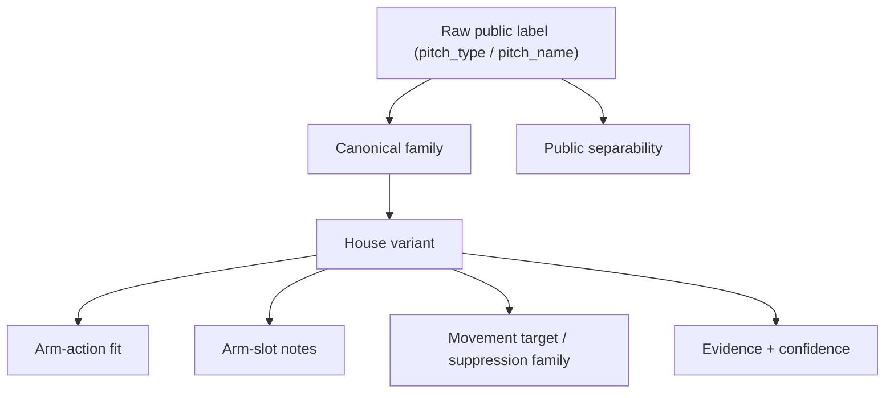

# Arm Action Research Round 3: Pitch Variant Matrix

Date: 2026-03-18

## Goal

Define the next knowledge-base layer for arm-action recommendations: keep the current eight-family engine intact, but add a variant layer that captures which public pitch labels are separable, which variants must remain internal, and which ideas are still too weakly supported to recommend.

This doc is intentionally research-first and code-free.

## Executive Takeaways

1. Public MLB data supports a wider pitch taxonomy than the current app canon. On 2026-03-18, the live MLB Stats API `pitchTypes` endpoint includes `Sweeper`, `Slurve`, `Slow Curve`, `Forkball`, `Screwball`, and `Gyroball` in addition to the core fastball/changeup/slider/curve families [citation:MLB Stats API pitchTypes](https://statsapi.mlb.com/api/v1/pitchTypes).
2. Raw Statcast surfaces are rich enough to preserve both `pitch_type` and `pitch_name`, so the knowledge base can store public labels without flattening everything to our current canon [citation:Baseball Savant CSV docs](https://baseballsavant.mlb.com/csv-docs).
3. Public summary surfaces are not uniformly granular. `pybaseball`'s pitch-movement entrypoint still advertises combined options like `SIFT` and `CUKC`, which implies that some leaderboard-style surfaces collapse two-seam/sinker and curveball/knuckle-curve distinctions [citation:pybaseball statcast_pitcher docs](https://github.com/jldbc/pybaseball/blob/master/docs/statcast_pitcher.md).
4. Primary biomechanics evidence supports the broad arm-action split already used in the app: breaking balls are more supinated than fastballs and changeups, while changeups track closer to fastballs than to breaking balls [citation:NCAA in-game kinematics study](https://pmc.ncbi.nlm.nih.gov/articles/PMC11653312/) [citation:Curveball systematic review](https://pmc.ncbi.nlm.nih.gov/articles/PMC4272688/).
5. The safe next step is not to add brand-new pitch families in code. It is to add a variant layer with explicit evidence/confidence fields, then enrich recommendation copy and future suggestions from that layer.

## Source Stack

### Primary public taxonomy sources

- Official MLB pitch taxonomy endpoint surfaced by `baseballr::mlb_pitch_types()` and `baseballr::mlb_pitch_codes()` [citation:baseballr mlb_pitch_types](https://github.com/BillPetti/baseballr/blob/master/R/mlb_pitch_types.R) [citation:baseballr mlb_pitch_codes](https://github.com/BillPetti/baseballr/blob/master/R/mlb_pitch_codes.R)
- Live MLB Stats API `pitchTypes` endpoint [citation:MLB Stats API pitchTypes](https://statsapi.mlb.com/api/v1/pitchTypes)
- Baseball Savant CSV field docs for raw Statcast payloads [citation:Baseball Savant CSV docs](https://baseballsavant.mlb.com/csv-docs)
- `pybaseball` Statcast docs for raw and summary query surfaces [citation:pybaseball statcast](https://github.com/jldbc/pybaseball/blob/master/docs/statcast.md) [citation:pybaseball statcast_pitcher](https://github.com/jldbc/pybaseball/blob/master/docs/statcast_pitcher.md) [citation:pybaseball statcast_pitcher_spin](https://github.com/jldbc/pybaseball/blob/master/docs/statcast_pitcher_spin.md)

### Primary mechanics sources

- NCAA in-game pitch-type kinematics paper comparing fastballs, changeups, and breaking balls [citation:NCAA in-game kinematics study](https://pmc.ncbi.nlm.nih.gov/articles/PMC11653312/)
- Curveball systematic review summarizing forearm-supination findings [citation:Curveball systematic review](https://pmc.ncbi.nlm.nih.gov/articles/PMC4272688/)
- Fleisig et al. kinetic comparison among fastball, curveball, changeup, and slider [citation:Fleisig pitch kinetics study](https://pubmed.ncbi.nlm.nih.gov/16260466/)
- Baseball Savant Active Spin explanation for gyro spin as a football-like spin axis with less movement-producing spin [citation:Baseball Savant Active Spin](https://baseballsavant.mlb.com/leaderboard/active-spin)

### Research-scope note

`openbiomechanics` remains useful for future kinematic priors, but it stays out of the production dependency path because of its non-commercial and sports-org license restrictions [citation:OpenBiomechanics README](https://github.com/drivelineresearch/openbiomechanics/blob/main/README.md).

## Public Taxonomy Snapshot

The live MLB `pitchTypes` list currently exposes these relevant codes [citation:MLB Stats API pitchTypes](https://statsapi.mlb.com/api/v1/pitchTypes):

| Cluster | Official codes / labels |
|---|---|
| Fastball cluster | `FA` Fastball, `FF` Four-seam FB, `FT` Two-seam FB, `SI` Sinker, `FC` Cutter |
| Offspeed cluster | `CH` Changeup, `FS` Splitter, `FO` Forkball |
| Breaking cluster | `SL` Slider, `ST` Sweeper, `SV` Slurve, `CU` Curveball, `KC` Knuckle Curve, `CS` Slow Curve |
| Exotic / rare | `SC` Screwball, `GY` Gyroball, `KN` Knuckleball, `EP` Eephus Pitch |

Two implementation consequences follow from that snapshot:

- Official public data already recognizes several labels our app currently flattens away.
- Not every official label deserves a recommendation path; some are better treated as research-only variants.

## What Public Data Can Actually Distinguish

### Raw Statcast rows

Raw Statcast exports include both `pitch_type` and `pitch_name`, which means the knowledge base can preserve the public label exactly when it exists [citation:Baseball Savant CSV docs](https://baseballsavant.mlb.com/csv-docs).

### Summary / leaderboard surfaces

Summary surfaces are coarser. `pybaseball`'s `statcast_pitcher_pitch_movement()` docs still advertise these pitch filters: `FF`, `SIFT`, `CH`, `CUKC`, `FC`, `SL`, `FS`, `ALL` [citation:pybaseball statcast_pitcher docs](https://github.com/jldbc/pybaseball/blob/master/docs/statcast_pitcher.md).

Inference from that interface:

- `Two-seam FB` and `Sinker` are sometimes merged into a single research bucket.
- `Curveball` and `Knuckle Curve` are sometimes merged into a single research bucket.
- `Slider` and `Sweeper` are not guaranteed to be separable on every public summary surface, even though the official taxonomy now distinguishes them.

That means the knowledge base needs a separability field, not just a label field.

## Mechanics Priors That Matter For Variant Expansion

The broad arm-action split is supported by current primary sources:

- In the NCAA in-game kinematics study, fastballs and changeups showed nearly identical forearm pronation/supination values at ball release, while breaking balls were materially lower, i.e. more supinated [citation:NCAA in-game kinematics study](https://pmc.ncbi.nlm.nih.gov/articles/PMC11653312/).
- The curveball systematic review reports that 7 of 8 studies found greater forearm supination on curveballs than on fastballs [citation:Curveball systematic review](https://pmc.ncbi.nlm.nih.gov/articles/PMC4272688/).
- Fleisig et al. found that the changeup had lower joint kinetics than the fastball and curveball, which supports treating it as a distinct offspeed branch rather than another breaking-ball subtype [citation:Fleisig pitch kinetics study](https://pubmed.ncbi.nlm.nih.gov/16260466/).
- Baseball Savant defines gyro spin as football-like spin where less of the total spin contributes to movement, which is the right official framing for a future gyro-slider variant record [citation:Baseball Savant Active Spin](https://baseballsavant.mlb.com/leaderboard/active-spin).

Important limit:

- These sources support family-level mechanics more strongly than variant-level mechanics. Exact calls like "kick change for supinators" or "gyro slider for pronators" still rely partly on internal baseball-research priors from the shipped arm-action overhaul, not on primary biomechanics papers alone.

## Recommended Knowledge-Base Shape



Recommended record shape:

```ts
type PitchVariantRecord = {
  variantId: string;
  canonicalFamily:
    | "Fastball"
    | "Sinker"
    | "Cutter"
    | "Splitter"
    | "Changeup"
    | "Curveball"
    | "Slider"
    | "Sweeper";
  publicLabels: string[];
  publicCodes: string[];
  separability: "raw-separable" | "summary-collapsed" | "house-variant-only";
  armActionFit: "Pronator" | "Supinator" | "Neutral" | "Mixed" | "Unknown";
  fitConfidence: "High" | "Medium" | "Low";
  armSlotNotes: string[];
  movementAnchorFamily:
    | "Fastball"
    | "Sinker"
    | "Cutter"
    | "Splitter"
    | "Changeup"
    | "Curveball"
    | "Slider"
    | "Sweeper";
  status: "ready-now" | "research-only" | "hold";
  evidence: Array<{
    claim: string;
    source: string;
    url: string;
    confidence: "High" | "Medium" | "Low";
  }>;
};
```

Key design rule:

- `canonicalFamily` should remain one of the existing eight engine families for now.
- `variantId` should drive copy, rationale, and future confidence tuning.
- `movementAnchorFamily` should remain the suppression/blend-detection target until we have variant-specific MLB movement baselines.

## Candidate Variant Matrix

The table below mixes direct evidence and explicit inference. When the arm-action fit is labeled as inference, that means the public source strongly supports the family but not the exact named variant.

| Variant | Canonical family | Public labels / codes | Separability | Arm-action fit | Notes | Status |
|---|---|---|---|---|---|---|
| Two-seam runner | `Sinker` | `FT`, `SI` | `summary-collapsed` | `Pronator` (inference, medium) | Official taxonomy separates two-seam and sinker, but public movement summaries may collapse them into `SIFT`; good candidate for a pronator arm-side fastball variant record | `ready-now` |
| Riding four-seam | `Fastball` | `FF`, `FA` | `raw-separable` | `Unknown` (low) | Useful for arsenal description, but not a pitch-add recommendation yet because the current engine recommends complements, not fastball redesigns | `research-only` |
| Cut fastball | `Cutter` | `FC` | `raw-separable` | `Supinator` (inference, medium) | Keep as a weak-supination fastball/slider bridge; current classifier already treats glove-side cutter movement as a supination signal | `ready-now` |
| Circle change | `Changeup` | `CH` | `house-variant-only` | `Pronator` (inference, medium) | Public sources separate changeup from breaking-ball families, but do not separate circle vs other grips; variant should stay house-defined | `ready-now` |
| Kick change | `Changeup` | `CH` or `FS` depending on classification | `house-variant-only` | `Mixed` (low) | Keep in KB because the shipped engine already uses it, but external primary evidence is still too thin to elevate confidence | `research-only` |
| Splitter | `Splitter` | `FS` | `raw-separable` | `Mixed` (medium) | Officially separable; keep as its own family in recommendations, but do not overclaim arm-action fit from current public sources alone | `ready-now` |
| Forkball | `Splitter` | `FO` | `raw-separable` | `Unknown` (low) | Official taxonomy supports it; useful as a future branch under the splitter family once movement baselines exist | `research-only` |
| Gyro slider | `Slider` | usually `SL`; `GY` exists officially but may not be used consistently | `house-variant-only` | `Supinator` family evidence high, exact variant evidence medium | Savant's gyro-spin explanation supports the spin concept, but "gyro slider" should still be modeled as a slider variant, not as a brand-new family | `ready-now` |
| Sweeper | `Sweeper` | `ST` | `raw-separable` | `Supinator` (family evidence high) | Officially distinct and already in the current engine; keep as a first-class variant and family | `ready-now` |
| Slurve | `Slider` | `SV` | `raw-separable` | `Supinator` (inference, medium) | Official public label exists; best treated as a slider-curve bridge variant before any new family work | `ready-now` |
| Knuckle curve | `Curveball` | `KC` | `summary-collapsed` | `Supinator` (family evidence high) | Officially separable in raw taxonomy, but some public movement summaries collapse it into `CUKC`; good candidate for curveball-specific copy | `ready-now` |
| Slow curve | `Curveball` | `CS` | `raw-separable` | `Supinator` (family evidence high) | Keep as a curveball subtype; especially useful for slower, steeper movement bands if we later add variant-specific chart overlays | `research-only` |
| Screwball | `Changeup` or `Sinker` movement neighbor, but no current canon fit | `SC` | `raw-separable` | `Unknown` (low) | Official label exists, but it does not fit the current eight-family engine cleanly and should stay out of recommendations for now | `hold` |
| Gyroball | no clean current-family fit | `GY` | `raw-separable` | `Unknown` (low) | Official label exists, but Savant's active-spin explanation makes it better treated as a spin-property concept than a recommendation target | `hold` |
| Knuckleball | no current-family fit | `KN` | `raw-separable` | `Unknown` (low) | Too specialized for the current recommendation system | `hold` |
| Eephus | no current-family fit | `EP` | `raw-separable` | `Unknown` (low) | Novelty pitch, not a recommendation target | `hold` |

## What This Means For The Next Expansion

### Safe to add to the knowledge base now

- `two-seam-runner`
- `circle-change`
- `gyro-slider`
- `slurve`
- `knuckle-curve`

These are the highest-value additions because they improve recommendation specificity without forcing a new movement-baseline system.

### Safe to track, but not recommend yet

- `forkball`
- `slow-curve`
- `kick-change`

These need either better primary-source backing, clearer public usage, or variant-specific movement baselines.

### Keep out of the engine

- `screwball`
- `gyroball`
- `knuckleball`
- `eephus`

The public taxonomy supports them, but they are too exotic or too weakly mapped to the current engine semantics.

## Recommended Implementation Order

1. Add a pure knowledge-base layer that stores `variantId`, `publicLabels`, `separability`, and evidence/confidence fields without changing `armAction.ts`.
2. Use that layer to improve rationale text inside the current eight-family recommendations:
   - `Slider` -> `gyro-slider` / `slurve`
   - `Curveball` -> `knuckle-curve`
   - `Changeup` -> `circle-change` / `kick-change`
   - `Sinker` -> `two-seam-runner`
3. Only after that, consider adding new recommendation nodes like `Forkball`, because new nodes need movement anchors, suppression zones, and likely new MLB-average reference data.

## Exact Next Research Step

Use the new machine-readable variant registry to run the first real validation pass:

1. compare 2-3 known pitchers across local TrackMan data and public Statcast labels
2. verify which labels survive the chosen public ingest path unchanged (`ST`, `SV`, `KC`, `CS`, `FO`)
3. decide whether any `summary-collapsed` variants need fallback alias rules before engine work
4. only then promote the registry into app-facing data or code

Companion artifact:

- [`arm_action_variant_registry.json`](arm_action_variant_registry.json) — machine-readable version of this matrix for future engine or tooling work
